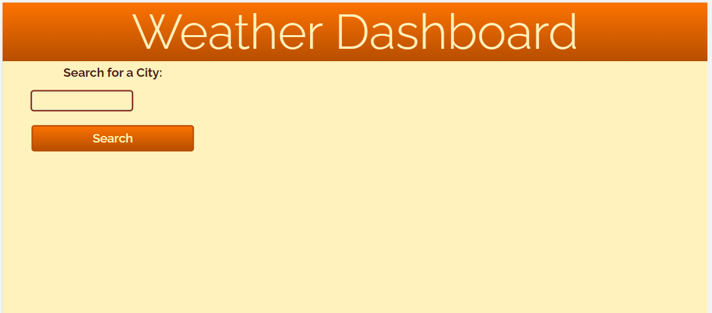
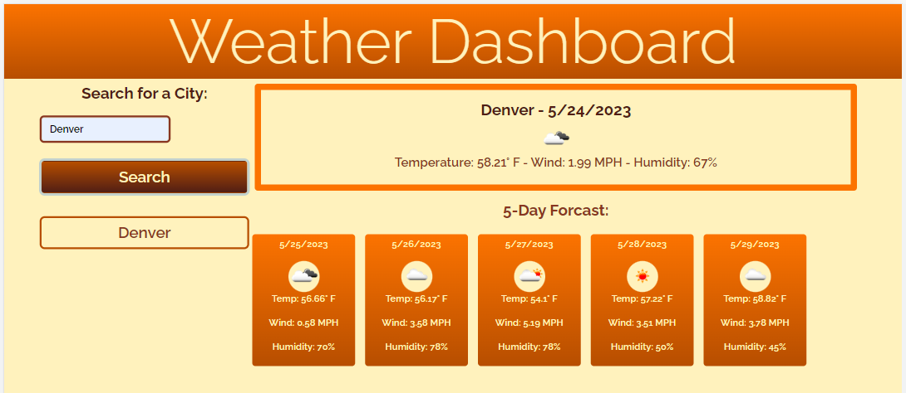
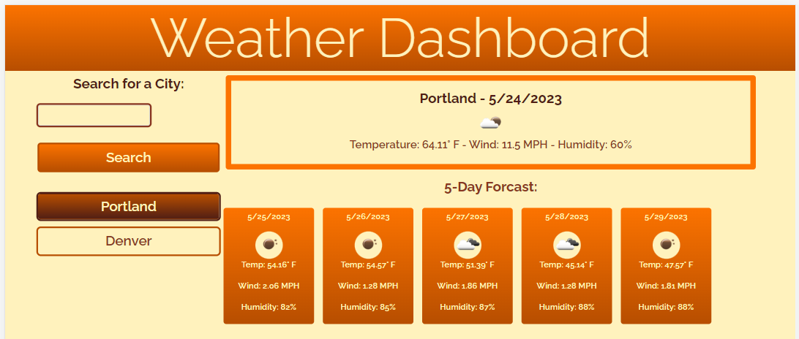
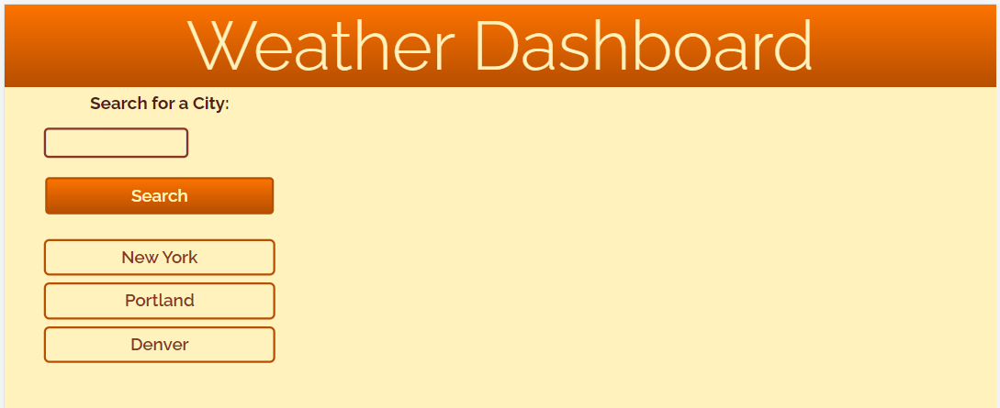

# Weather Application

## Description

In this project, I worked to create a weather application with HTML, CSS, and JavaScript. I was motivated to provide a page where the user can access current weather information for a city using the OpenWeather API.

This website was created for the purpose of quickly accessing current and future 5-day weather for a given city. I created a website where cities can be searched quickly and recent searches would be saved locally to be clicked on again if needed.

Through the process of coding this weather application, I was able to learn more about utilizing a third party API to my advantage. I also had the opportunity to better acquaint myself with JSON, arrays, functions, variables, and for loops in JavaScript. My biggest coding challenge for this project was to figure out the best way to call the recent search buttons to reload properly. Through many trials and errors (and assistance from my tutor and TA), I was able to discover a working solution to reloading recent searches.

[Here is a link to the webpage](https://sarah-paterson.github.io/Weather-Dashboard/).

---
---

## Table of Contents

- [Weather Application](#weather-application)
- [Credits](#credits)
- [License](#license)

---
---

## Weather Application

### Load Page

Here is the page on first load. A simple weather application where you can easily search for a city to find current weather data.

### Search Location

Once a city is entered, the current weather information as well as the future five day weather information appears, and a recent search button appears for that city. Each city is saved locally.

### Search Again for Recent Searches

The user has the opportunity to click on a recent search button to load the current weather data.

### Reload Page

Because the cities are saved locally, the recent buttons will be there on reload each time.

---

## Credits

Open Weather API: https://openweathermap.org/forecast5

JavaScript Weather App Tutorial on YouTube via Shanjai Raj : https://youtu.be/GXrDEA3SIOQ

My tutor, Collin Porter: cporter@bootcampspot.com
My TA, Andrew Stehno: https://github.com/ObviousEcho

Helpful Resources:
W3 School’s information about JavaScript: https://www.w3schools.com/js/default.asp
Stack Overflow’s answered questions about JavaScript: https://stackoverflow.com/
MDN’s information on JavaScript: https://developer.mozilla.org/en-US/
Google.com helping me find the above resources
The Bootcamp gitLab DU-VIRT-FSF-PT-04-2023-U-LOLC repository

The README template I used was provided by The Full-Stack Blog: https://coding-boot-camp.github.io/full-stack/github/professional-readme-guide

---

## License
MIT Licence
